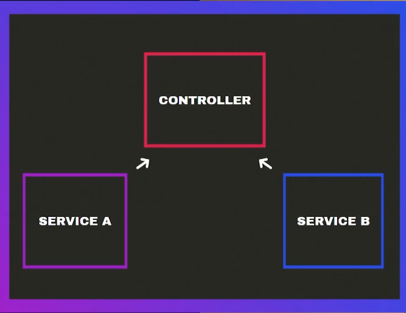

# Nest notes

Nest's target is to give an structure for those project big enough to need it
Nest comes with a set of tools, pretty useful, also a CLI. Its main language is
TS but also supports JS, just like TS do it

Nest uses a lot of decorators to handle basically everything, Angular-like, however
it seems to be a cool tool, its architecture can be seem in the next image

## Nest architecture


#### Nest by parts

Controllers can be identified easily, through @Controller decorators

Services can be always use the @Injectable decorator

Pipes also use the @Injectable decorator, whereas pipes use it in a different way to
inject code through requests; Pipes can be identified by the PipeTransform class they
implements

Modules use the @Module decorator, modules are wrappers for a set of entities, they can
also be seem as sets of specific information, including everything matters for, for example
product module should include "Category", "Brand" & "Product"; since those entities are
everything matters for stock in a store. Other example can be Users module, that module
could hots "Customers" or "Clients", also "Managers" or "Admins"; since both of them are
simply roles inside the platform

##### Modules communication

Modules are isolated, so communication between them can be tricky, it's pretty simple,
if a module needs something from other that module who hosts the service needs to export
the service/s using the `expots` field inside <MODULE>.module.ts file, then this module
who needs the service can use the `imports` field in its own <MODULE>.module.ts to import
the service, is quite simple, Nest exports services but imports modules

#### Some useful features

Nest CLI supports alias like "g" for "generate", is quite simple to follow, first letter or
first two are alias for whole word like "co" for "controller" or "s" for "service" and so on

| Action                | Command                                  | Description                                                                                |
| --------------------- | ---------------------------------------- | ------------------------------------------------------------------------------------------ |
| Create a nest project | `npx nest new <PROJECT_NAME>`            | Creates a new Nest project                                                                 |
| Create a controller   | `npx nest g co <DIRECTORY>/<CONTROLLER>` | Creates a controller in <DIRECTORY> using <CONTROLLER> name                                |
| Create a service      | `npx nest g s <DIRECTORY>/<SERVICE>`     | Creates a service in <DIRECTORY> using <SERVICE> name                                      |
| Create a pipe line    | `npx nest g p <DIRECTORY>/<PIPE>`        | Creates a pipe line in <DIRECTORY> (usually called "common" or "shared") using <PIPE> name |
| Create a module       | `npx nest g mo <MODULE>`                 | Creates a module in ./src using <MODULE> name                                              |

## Patters

### DTO

Data Transfer Objects aliased as DTO or "dtos", are a Objects created with the purpose of
adding some kind of "shield" to ensure that data from requests is going to match the right
data type, this is a way different from a net feature, its goal is to reduce the amount of bugs

### Dependencies Injection, Singleton and @Injectable()

The Dependencies Injection is a patter which is used to split things; software is easier to
maintain this way so it's pretty useful; Nest uses the @Injectable() decorator to handle with this
using the Singleton patter, so we split code in services to make it maintainable, but we also use it
through a Singleton patter to reduce the amount of instances we invoke using the @Injectable()
decorator; to make this architecture works we use wrappers, those wrappers are our "modules", quite
simple to follow, modules host services that uses @Injectable() decorator to be used by controller
through a Singleton patter, Nest achieve this using TS syntax to identify when it needs to send a
common instance for those controllers who use those services instances



At the end we have controllers who can inject multiple services, but those services aren't going
to incur in stack overflow due to Singleton

### Circular Dependency Injection

This can happen if we don't play attention to what we are doing, the Circular Dependency Injection
is an "special" case of the Dependency Injection patter; everything is wrong about it, same as a
snake biting its own tail, this "Circular" systems incur into a circular reference error, so Nest can
resolve what to Inject


## Providers

### useClass

Nest uses different providers, by default inside the `providers` statement Nest uses `useClass`,
this provider indicates Nest modules that we are using a service which is going to be invoke outside
the module; Nest achieve this behaviour by using something similar to destructing, casting this:

> _example.module.ts_

```typescript
@Module({
  provider: [ServiceA]
})
```

Into this:

> _example.module.ts_

```typescript
@Module({
  provider: [
    {
      provide: ServiceA,
      useClass: ServiceA,
    }
  ]
})
```

This Objects, contains two attributes, `provide` which is the name that service is going to be called,
also `useClass` attribute indicates Nest to wrapper the `provide` parameter using the Module

### useValue

Quite similar to `useClass`, `useValue` provider handle with Objects, but in this case; it's used to
provide data, such as value, arrays, strings, etc.

> _example.module.ts_

```typescript
const API_KEY = "somewhere.com/somedata&something=1"
const PROD_API_KEY = "prodenv.com/proddata&something=prod"

@Module({
  provider: [
    {
      provide: 'API_KEY',
      useValue: process.env.NODE_ENV === "prod" ? PROD_API_KEY : API_KEY,
    }
  ]
})
```

Then we use it like this:

> ._example.service.ts_

```typescript
import { Injectable, Inject } from '@nestjs/common';

@Injectable()
export class AppService {
  constructor(@Inject('API_KEY') private apiKey: string) {}

  getExample(): string {
    return `API key ${this.apiKey}`;
  }
}
```

That example show how to share an API key according to process stage, development/test or production.
`useValue` is quite useful for testing purpose, but also for sharing data, such as API keys

### useFactory

This is an asynchronous provider that uses a factory allowing injections; this option is particularly
useful with we need to fetch data, bringing resources from other API, let's imaging a case in where we
are using a task queue, but that queue is handled by other app, that app make it's for handling it or
even it comes from an external provider, so there no options to include it inside our Nest app, how can
we bring that data? Using `useFactory` of course, because its a technical requirement to handle it in
different modules

> _example.module.ts_

```typescript
import { HttpModule, HttpService } from '@nestjs/axios';

@Module({
  imports: [HttpModule],
  provider: [
    {
      provide: 'TASKS',
      useFactory: async () => {
        const tasks = await http
          .get('https://jsonplaceholder.typicode.com/todos')
          .toPromise();
        return tasks;
      },
    }
  ]
})
```

> _example.service.ts_

```typescript
import { Injectable, Inject } from '@nestjs/common';

@Injectable()
export class ExampleService {
  constructor(@Inject('TASKS') private tasks: any[]) {}

  getExample(): any {
    console.log(this.tasks);
  }
}
```

In this example we use the `useFactory` provider to fetch data from an external resource
called 'jsonplaceholder', this is bringing some fake data

> Note #1: Don't use the `useFactory` to call external resources, this action with slow down the API_KEY

> Note #2: It is better to use the `HttpModule` inside service to avoid slowing down the app on initialization

### @Global @Module

`Global Module` an everything inside it is going to be instanced for the rest of the modules,
in other words, it creates an instance with no necessity of importing that specific module to
inject that instance. `@Global @Module` are used to handle with global generic data, such as
API keys, constants values, data base connection, etc.

###### Use case

Let's imagine a module who needs the API_KEY, used in "example.module.ts", what happen if I need that
API_KEY inside a module like app.module.ts, Do we import the app.module.ts inside this module? No,
that's an anti-patter, then what do I do? Well, that's a perfect example of `Global Module`; this tool
is useful, but a little tricky, perhaps putting everything in there is not a good idea (Anti-patter),
since @Module has a scope, app.module.ts can't share instances with modules whose scope isn't inside
the app module scope, in other words, a module "xyz.module.ts" can't use 'app.module.ts' injections, it
means that only controllers and services inside "app.module.ts" will have access to them. An example
can be found at

> /src/database/database.module.ts from [this commit](https://github.com/AndresMpa/courses/tree/7f2757de5f8d1b6552ac1aa61e5a2141194eb3d5)

To use the global module data, it just same as seen before

## Accessing configurations

Nest have 2 different ways to bring data from other files, using the ConfigService, or using a configuration
file; every options comes with different pros and cons, but as general tip, ConfigService is used for small
projects and configuration files are more common in big projects

### ConfigService

Using the ConfigService, allow Nest to use a .env file, those files can be used according to stages, but their
purpose is to storage data such as API keys, credentials, etc. The path to the corresponding file is defined at
envFilePath field, then to be used globally isGlobal need to be set as true, after those simple configurations
we can use the ConfigService to create an instance of it in our services, to access .env we use the get() method
and the key to that value, "DATA_FROM_DOT_ENV" in example belong

> random.module.ts

```typescript
import { ConfigModule } from '@nestjs/config';

@Module({
  imports: [
    ConfigModule.forRoot({
      envFilePath: '.env',
      isGlobal: true,
    }),
  ],
})
export class RandomModule {}
```

> random.service.ts

```typescript
import { ConfigService } from '@nestjs/config';

@Injectable()
export class RandomService {
  constructor(private configService: ConfigService) {}

  example() {
    return this.configService.get('DATA_FROM_DOT_ENV');
  }
}
```

### Configuration file

It's pretty simple to use, we need to create a file (config.ts) which is going to handle with .env files as
simple as this can be we need registerAs method to achieve this behaviour, we can create set of data using
objects (like someObject in the example belong), since Nest allow us to use more than 1 .env file, we have
to load ours, using the load field inside the corresponding module, last step is using the information
contained in a instance of ConfigType, no get() methods are required to invoke data this way, avoiding typos
due to miss writing any key, this is the main different with previous method

> config.ts

```typescript
import { registerAs } from '@nestjs/config';

export default registerAs('config', () => {
  return {
    someObject: {
      dataFromDotEnv: process.env.DATA_FROM_DOT_ENV,
      moreDataFromDotEnv: process.env.MORE_DATA_FROM_DOT_ENV,
    },
    otherObject: process.env.OTHER_OBJECT,
  };
});
```

> random.module.ts

```typescript
import { ConfigModule } from '@nestjs/config';
import config from './config';

@Global()
@Module({
  imports: [
    ConfigModule.forRoot({
      envFilePath: '.env',
      load: [config],
      isGlobal: true,
    }),
  ],
})
export class RandomModule {}
```

> random.service.ts

```typescript
import { ConfigType } from '@nestjs/config';
import config from './config';

@Injectable()
export class RandomService {
  constructor(
    @Inject(config.KEY) private configService: ConfigType<typeof config>,
  ) {}

  getExample(): string {
    const dataFromDotEnv = this.configService.someObject.dataFromDotEnv;
    const otherObject = this.configService.otherObject;

    return `dataFromDotEnv: ${dataFromDotEnv} - otherObject: ${otherObject}`;
  }
}
```

## Data bases connection

Nest comes with some native support for sequelize and typeORM, in order to follow the TS ecosystem it
is recommended to use typeORM, both approach comes with differences; when we are talking about a database
their are not always needed, since we can create queries using simple SQL and a simple database connection
we could deal with a team to use a simple connection, then when projects gets bigger enough, we should/could
use an ORM, in Nest using each approach we could have something like this:

### Direct connection

If we use a specific file to handle with database connections (Do it), we could use an global module to share
the database connection using a useFactory, in order to have only one instance of it (Which is more maintainable),
using this method we get a simple global connection

```typescript
@Global()
@Module({
  providers: [
    {
      provide: 'POSTGRES',
      useFactory: (configService: ConfigType<typeof config>) => {
        const { user, host, database, password, port } = configService.database;
        const client = new Client({
          user,
          host,
          database,
          password,
          port,
        });
        client.connect();
        return client;
      },
      inject: [config.KEY],
    },
  ],
  exports: ['POSTGRES'],
})
```

### ORM way (TypeORM)

When our project get bigger or simply if we want to use them, we have the ORMs, this is an example using
typeORM, which is the recommended ORM to use in Nest using TS

```typescript
@Global()
@Module({
  imports: [
    TypeOrmModule.forRootAsync({
      inject: [config.KEY],
      useFactory: (configService: ConfigType<typeof config>) => {
        const { user, host, database, password, port } = configService.database;
        return {
          type: "postgres",
          host,
          port,
          database,
          password,
          username: user,
        };
      },
    }),
  ],
  exports: [TypeOrmModule],
})
```

Then we have to change a little the way our entities are defined, since TypeORM handle with models, our
entities match what a model is, a quick example can be the products entity

```typescript
import { Column, Entity, PrimaryGeneratedColumn } from 'typeorm';

@Entity()
export class Product {
  @PrimaryGeneratedColumn()
  identifier: number;

  @Column({
    unique: true,
    type: 'varchar',
    length: 255,
  })
  name: string;

  @Column({
    type: 'text',
  })
  description: string;

  @Column({
    type: 'int',
  })
  price: number;

  @Column({
    type: 'int',
  })
  stock: number;

  @Column({
    type: 'varchar',
  })
  image: string;
}
```

In that example we converted the product entity into a Entity as what a entity is for SQL model,
once the model is created it is necessary to register that Entity in the module

```typescript
import { TypeOrmModule } from '@nestjs/typeorm';
...
import { Product } from './entities/product.entity.ts';

@Module({
  imports: [TypeOrmModule.forFeature([Product])],
  ...
})
```

That is pretty simple to do, as seen before

### Sync mode

An important feature to talk about is the `synchronize`, widely known as the "sync mode", is feature
that many other ORMs use such as Djgano, Lavaravel, sequelize, etc. This particular mode enable our
ORM to make some changes in our data base, to make its structure match with what we are doing, this
feature makes our development experience something less painful, but it can also cause several problems
in production stages, that why it's highly recommended not to use it on production
