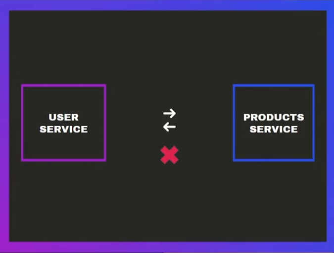

# Nest notes

Nest's target is to give an structure for those project big enough to need it
Nest comes with a set of tools, pretty useful, also a CLI. Its main language is
TS but also supports JS, just like TS do it

Nest uses a lot of decorators to handle basically everything, Angular-like, however
it seems to be a cool tool, its architecture can be seem in the next image

## Nest architecture

#### Nest by parts

Controllers can be identified easily, through @Controller decorators

Services can be always use the @Injectable decorator

Pipes also use the @Injectable decorator, whereas pipes use it in a different way to
inject code through requests; Pipes can be identified by the PipeTransform class they
implements

Modules use the @Module decorator, modules are wrappers for a set of entities, they can
also be seem as sets of specific information, including everything matters for, for example
product module should include "Category", "Brand" & "Product"; since those entities are
everything matters for stock in a store. Other example can be Users module, that module
could hots "Customers" or "Clients", also "Managers" or "Admins"; since both of them are
simply roles inside the platform

##### Modules communication

Modules are isolated, so communication between them can be tricky, it's pretty simple,
if a module needs something from other that module who hosts the service needs to export
the service/s using the `expots` field inside <MODULE>.module.ts file, then this module
who needs the service can use the `imports` field in its own <MODULE>.module.ts to import
the service, is quite simple, Nest exports services but imports modules

#### Some useful features

Nest CLI supports alias like "g" for "generate", is quite simple to follow, first letter or
first two are alias for whole word like "co" for "controller" or "s" for "service" and so on

| Action                | Command                                  | Description                                                                                |
| --------------------- | ---------------------------------------- | ------------------------------------------------------------------------------------------ |
| Create a nest project | `npx nest new <PROJECT_NAME>`            | Creates a new Nest project                                                                 |
| Create a controller   | `npx nest g co <DIRECTORY>/<CONTROLLER>` | Creates a controller in <DIRECTORY> using <CONTROLLER> name                                |
| Create a service      | `npx nest g s <DIRECTORY>/<SERVICE>`     | Creates a service in <DIRECTORY> using <SERVICE> name                                      |
| Create a pipe line    | `npx nest g p <DIRECTORY>/<PIPE>`        | Creates a pipe line in <DIRECTORY> (usually called "common" or "shared") using <PIPE> name |
| Create a module       | `npx nest g mo <MODULE>`                 | Creates a module in ./src using <MODULE> name                                              |

#### Patters

##### DTO

Data Transfer Objects aliased as DTO or "dtos", are a Objects created with the purpose of
adding some kind of "shield" to ensure that data from requests is going to match the right
data type, this is a way different from a net feature, its goal is to reduce the amount of bugs

##### Dependencies Injection, Singleton and @Injectable()

The Dependencies Injection is a patter which is used to split things; software is easier to
maintain this way so it's pretty useful; Nest uses the @Injectable() decorator to handle with this
using the Singleton patter, so we split code in services to make it maintainable, but we also use it
through a Singleton patter to reduce the amount of instances we invoke using the @Injectable() 
decorator; to make this architecture works we use wrappers, those wrappers are our "modules", quite
simple to follow, modules host services that uses @Injectable() decorator to be used by controller
through a Singleton patter, Nest achieve this using TS syntax to identify when it needs to send a
common instance for those controllers who use those services instances

At the end we have controllers who can inject multiple services, but those services aren't going
to incur in stack overflow due to Singleton

##### Circular Dependency Injection

This can happen if we don't play attention to what we are doing, the Circular Dependency Injection
is an "special" case of the Dependency Injection patter; everything is wrong about it, same as a
snake biting its own tail, this "Circular" systems incur into a circular reference error, so Nest can
resolve what to Inject

