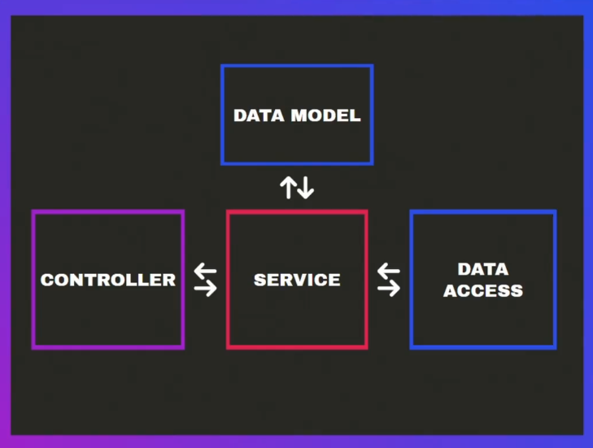

Nest's target is to give an structure for those project big enough to need it
Nest comes with a set of tools, pretty useful, also a CLI. Its main language is
TS but also supports JS, just like TS do it

Nest uses a lot of decorators to handle basically everything, Angular-like, however
it seems to be a cool tool, its architecture can be seem in the next image

Controllers can be identified easily, through @Controller decorators

Services can be always use the @Injectable decorator

Pipes also use the @Injectable decorator, whereas pipes use it in a different way to 
inject code through requests

#### Some useful features

| Action                | Command                                  | Description                                                                                                                                                                                         |
| --------------------- | ---------------------------------------- | --------------------------------------------------------------------------------------------------------------------------------------------------------------------------------------------------- |
| Create a nest project | `npx nest new <PROJECT_NAME>`            | Creates a new Nest project                                                                                                                                                                          |
| Create a controller   | `npx nest g co <DIRECTORY>/<CONTROLLER>` | Nest CLI supports alias like "g" for "generate", "co" for "controller", this command creates a controller on <DIRECTORY> directory using <CONTROLLER> controller name                                     |
| Create a service      | `npx nest g s <DIRECTORY>/<SERVICE>`     | Nest CLI supports alias like "g" for "generate", "s" for "service", this command creates a service on <DIRECTORY> directory using <SERVICE> service name                                                  |
| Create a pipe line    | `npx nest g p <DIRECTORY>/<PIPE>`        | Nest CLI supports alias like "g" for "generate", "p" for "pipe", this command creates a pipe line on <DIRECTORY> directory (usually that directory is called "common" or "shared") using <PIPE> pipe name |
