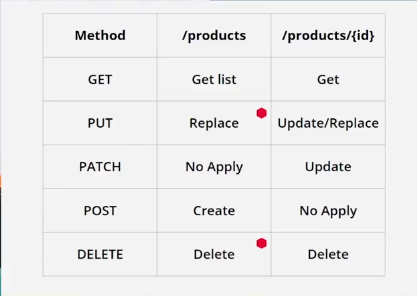

# According to convention

GET is used to list info from an endpoint,
also used to get individual information

PUT can replace information from an entire
entity but {! Warning, this is no a good practice},
it also can update or replace individual information

PATCH is similar to PUT, but this HTTP method can't
modify an entire entity, it was thought to modify
specific information, for example; on PUT we'll change
the whole row on a BD, while on PATCH we modify just an
attribute

POST is used to create information, it can not create
individual information (it creates individual pieces
of information by default)

DELETE least but not less; is a method created to be
used on rows (On SQL DBs), it is a bad idea to
remove more than one per query, but it can be used
for it
