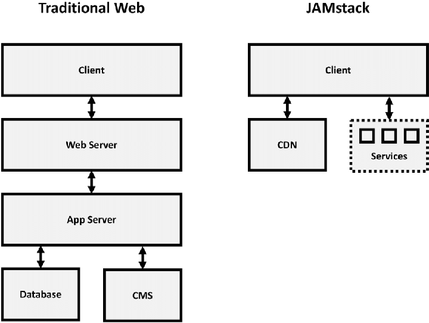
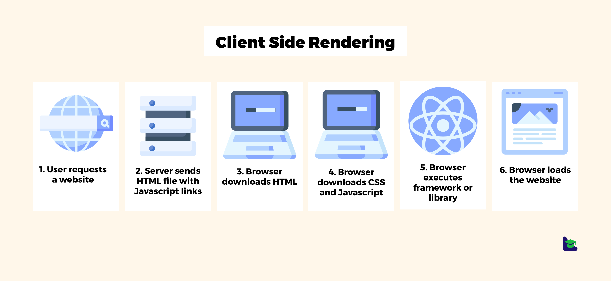
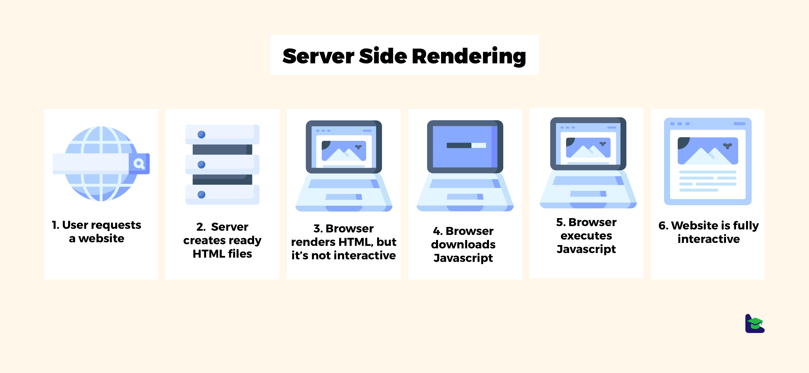

# Static pages & Jamstack

## Concepts

### Jamstack

Jamstack is an architecture in which everything in rendered in the browser
this architecture is pretty fast. Jamstack is basically a CSR architecture

Ref: https://jamstack.wtf/

### Rendering

It's the process to convert data into HTML, we can classify each "mode" of
rendering as:

- Client-side rendering (CSR): HTML construction happens on the users browser. Works on client demand

- Server-side rendering (SSR): HTML construction happens on a server, then sends the HMTL to the browser. Works on server demand

- Static Generation rendering (SGR): HTML construction happens on "build time" or generation (On the server), it means that this rendering process happens only one time

Note: Nextjs is able to create hybrid apps that mix each rendering mode

Ref 1: https://morioh.com/a/9f0457b8ee5f/client-side-rendering-or-server-side-rendering-what-is-the-best-solution-for-your-app
Ref 2: https://platzi.com/blog/spa-vs-ssr-vs-static-site-generators/

### Content management systems (CMS)

A content management system (CMS) is computer software used to manage the creation and modification of digital content (content management).

Option 1: https://www.contentful.com/
Option 2: https://www.sanity.io/exchange/framework=nextjs (With Nextjs support)
Option 3: https://strapi.io/integrations/nextjs-cms (With Nextjs support)
Option 4: https://hygraph.com/ (For GraphQL)
Option 5: https://directus.io/ (Open Source)
Option 6: https://prismic.io/

### Design Systems

A design system is a collection of reusable components that follows an standard useful to build any app

Option 1: https://mui.com/
Option 2: https://auradesignsystem.com/
