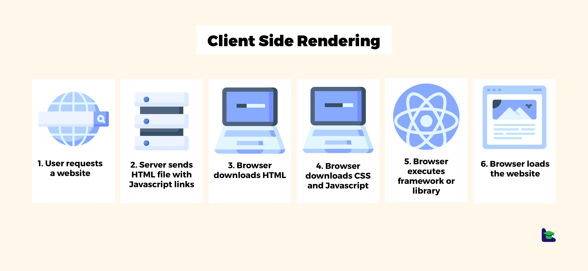

# Static pages & Jamstack

## Concepts

### Jamstack

Jamstack is an architecture in which everything in rendered in the browser
this architecture is pretty fast. Jamstack is basically a CSR architecture


Ref: https://jamstack.wtf/

### Rendering

It's the process to convert data into HTML, we can classify each "mode" of
rendering as:

- Client-side rendering (CSR): HTML construction happens on the users browser. Works on client demand



- Server-side rendering (SSR): HTML construction happens on a server, then sends the HMTL to the browser. Works on server demand


- Static Generation rendering (SGR): HTML construction happens on "build time" or generation (On the server), it means that this rendering process happens only one time

Note: Nextjs is able to create hybrid apps that mix each rendering mode

- Ref 1: https://morioh.com/a/9f0457b8ee5f/client-side-rendering-or-server-side-rendering-what-is-the-best-solution-for-your-app
- Ref 2: https://platzi.com/blog/spa-vs-ssr-vs-static-site-generators/

### Content management systems (CMS)

A content management system (CMS) is computer software used to manage the creation and modification of digital content (content management).

- Option 1: https://www.contentful.com/
- Option 2: https://www.sanity.io/exchange/framework=nextjs (With Nextjs support)
- Option 3: https://strapi.io/integrations/nextjs-cms (With Nextjs support)
- Option 4: https://hygraph.com/ (For GraphQL)
- Option 5: https://directus.io/ (Open Source)
- Option 6: https://prismic.io/

#### Contentful

Here there are 3 APIs:

- Content delivery API (CDA) which is the one who handles with updates
- Content management API (CMA) which is the one who handles the content creation
- Content Preview API (CPA) handles with previewing content

To use then it's necessary to create a persona access token (PAT) also an API key:

- To create the API key: Settings > API Keys
- To create the PAT: Settings > CMA Tokens

##### Contentful GraphQL server

There's something cool about contentful which is its server available here:
https://graphql.contentful.com/content/v1/spaces/{SPACE}/explore?access_token={CDA_TOKEN}

Then both things can be use to handle with the CLI

### Design Systems

A design system is a collection of reusable components that follows an standard useful to build any app

- Option 1: https://mui.com/
- Option 2: https://auradesignsystem.com/

### Rendering strategy (Nextjs)

Using Nextjs the rendering strategies look like this:

#### Client-side rendering

As usual we simply use 2 hooks (Or more) to get the data inside a state

```jsx
import { getPlantList } from '../api/'
import { Layout } from '@components/Layout'
import { PlantCollection } from '@components/PlantCollection'
import { useEffect, useState } from 'react'
```

```jsx
export default function Home() {
  const [plantData, setPlantData] = useState<Plant[]>([])

  useEffect(() => {
    getPlantList({ limit: 10 }).then((data) => setPlantData(data))
  }, [])

  return (
    <Layout>
      <PlantCollection plants={plantData} variant="square" />
    </Layout>
  )
}
```

#### Server-side rendering

To render things from the Nextjs server we need to take in consideration a couple of this,
there's a feature call "GetStaticProps" we can use it to create a SSR strategy, it's pretty
simple, we just need to create a new export inside a component at `/pages`, this strategy
only works inside the `/pages` directory, after adding the export we just need to infer its
type using `InferGetStaticPropsType` we infer the type of that exported function, that function
should fulfil the props of the component

> Note: IT MUST BE INSIDE `/pages`

```jsx
import { GetStaticProps, InferGetStaticPropsType } from 'next'
import { getPlantList } from '@api/index'

import { PlantCollection } from '@components/PlantCollection'
import { Layout } from '@components/Layout'

type HomeProps = {
  plantData: Plant[]
}
```

```jsx
export const getStaticProps: GetStaticProps<HomeProps> = async () => {
  const plantData = await getPlantList({ limit: 10 })

  return {
    props: { plantData },
  }
}

export default function Home({
  plantData,
}: InferGetStaticPropsType<typeof getStaticProps>) {
  return (
    <Layout>
      <PlantCollection plants={plantData} variant="square" />
    </Layout>
  )
}
```

### GetStaticPaths

While `GetStaticProps` gets the information, `GetStaticPaths` defines the pages
that the server will need to create will building any content (On SSG). It's usage
is pretty simple:

```jsx
import { GetStaticPaths } from 'next'
```

```jsx
export const getStaticPaths: GetStaticPaths = async () => {
  const entries = await getItemsList({ limiet: 10 })

  const paths: AnyType[] = entries.map((item) => ({
    params: { slug: item.slug },
  }))

  return {
    paths,
    fallback: false, // This means default 404
  }
}
```

Where `AnyType` will be a type

#### Trade offs

##### Pros

- It builds only HTML, CSS and JS files so SSG doesn't need a lot of resources
- SSG it's not an expensive hard computations work
- SSG can be supported on a CDN
- SEO and performance are better than other strategies

##### Cons

- Not everything can be generated under this strategy
- RT strategies aren't supported by this strategy
- Data is directly injected in the HTML
- Performance decrease significantly when pages on `GetStaticPaths` increase

### Incremental Site Generation

ISG is an improvement to SSG, SSG owns some issues when we try to add multiple
pages so when we want to render multiple pages SSG is not good option, since
the increasing of pages is equivalent to the worsening of performance. Using it
is really simple you just need to add the following property.

```jsx
export const getStaticProps: GetStaticProps<EntryProps> = async ({
  params,
}) => {
  // ...

  try {
    // ...
    return {
      props: { ... },
      revalidate: 5 * 60, // It means refresh => Every 5 min
    }
  }

  // ...
}
```

The only thing you need the do is to use the property `revalidate`, giving it
an amount of time.

When there's and `GetStaticPaths` you also need to use another strategy for the
`fallback` parameter

```jsx
export const getStaticPaths: GetStaticPaths = async () => {
  // ...
  return {
    paths,
    fallback: 'blocking',
  }
}
```

Available `fallback` options are `false`, `blocking` & `true`; each option means:

- `false`: A simple default 404 page (That you need to create)
- `blocking`: It means that the server will fetch content once some data is required, so the component will wait until the data gets into the frontend, in other words, it will wait until HTTP is done
- `true`: Useful for loading skeletons, this option let the component handle with the loading screen

> Note: `fallback: true` is useful when data takes a lot of time to be fetch other ways `fallback: "blocking"` is simply better

#### Stale-While-Revalidate

This approach is useful for pages whit some tolerance on the criticality of information
for example a footer don't need to update its data as frequently as a product page

#### Trade offs

##### Pros

- ISG is basically Server-Side Rendering (SSR) + Server-Static Generation (SSG)
- Building time doesn't increase whit the amount of pages
- Revelation increases pages flexibility

##### Cons

- ISG requires a node.js server
- ISG is not an option for viral pages or RT responses
- ISG is not an option for RT, User pages, custom data or dashboards
- ISG complexity is not worth for pages whit few data such as blogs, it is worth for pages whit thousands of entries other options like SSG must be enough for least data

#### Other options

##### Server-Side Rendering (SSR)

###### Pros

- Data is always updated

- Fetched data can be modified on demand

###### Cons

- It can be expensive, each fetch "hits" the server, that behavior can be expensive

##### Server-Static Generation (Export)

###### Pros

- This way everything goes too fast, since `next export` removes the backend server (Node.js). So, in the end using the SSG we just render HTML, CSS and JS (That's what next.js build), allowing you to deploy your app as an static pages, useful for GitHub pages for example

###### Cons

- Using `next export` we lose the benefits of SSR, ISG, `revalidate`, routes, internalization & image optimization

### Bonus

```jsx
import fs from 'fs'
import path from 'path'

export const getStaticPaths: GetStaticPaths = async () => {
  const dataFromFile = fs
    .readFileSync(path.join(process.cwd(), 'path.txt'), 'utf-8')
    .toString()

  const entriesFromFile = dataFromFile.split('\n').filter(Boolean);

  const paths: PathType[] = entriesFromFile.map((slug) => ({
    params: {
      slug,
    },
  }))

  return {
    paths,
    fallback: false,
  }
}
```

Inside `getStaticPaths` or `getStaticProps` we can use some server benefits such
as `fs` or `path`, essentially those features are part of the next.js server

> DO NOT use any of those benefits inside of ANY React component

### Environments variables

This is pretty simple Nextjs uses `process.env.VARIABLE` & `process.env.NEXT_PUBLIC_[VARIABLE]`
the different is pretty simple anything with `NEXT_PUBLIC_` can be used for Client-Side Render

Ref: https://nextjs.org/docs/pages/building-your-application/configuring/environment-variables

#### Cross-env

Something important about environment variables are OS, Windows & Unix differ significantly between
OS:

```bash
# Windows
set MY_SECRET=<your token here>

# Unix (macOS + Linux)
export MY_SECRET=<your token here>
```

In the end most of the server provide an option to handle with those variables without extra configurations,
some extra references:

- [GitHub Action](https://docs.github.com/es/actions/security-guides/using-secrets-in-github-actions)
- [Heroku](https://devcenter.heroku.com/articles/config-vars)
- [Vercel](https://vercel.com/docs/projects/environment-variables)
