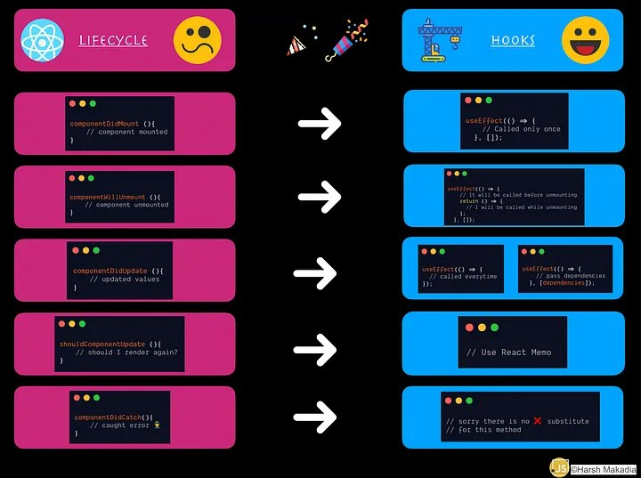

# About this course

`useState` is just the beginning of React state management,
we can use `component` or functions with `hooks`, we can
use simple state or complex/compound states, we can even
handle with state in declarative way or imperative way.
All those possibilities allow us to have find the best
possible solution

The aim of this course is to understand those possibilities
also handle with them to achieve the best solutions, it
extends our toolbox.

## Project - Security codes

The idea is to have a confirmation code, trough state of
React, having some states to handle with it

## Key differences between React.Component and React.useState

> Deeper explanation [here](https://javascript.plainenglish.io/lifecycle-methods-substitute-with-react-hooks-b173073052a)

Hooks "ate" life cycle, is that simple; `useEffect` replaces
a lot of previous functions from life cycle. Check the image
below



Let's see the way `useEffect` bully life cycle

### One shot behaviour

```javascript
  componentDidMount() {
    console.log("componentWillMount");
  }
  useEffect( () => {
    /*
      This is equivalent to componentWillMount
      when the second parameter at useEffect
      is "[]" this means 'Do it the first time'
    */
  }, [])
```

### Multi calls

```javascript
  componentDidUpdate() {
    console.log("componentDidUpdate");
  }
  useEffect( () => {
    /*
      This is equivalent to componentDidUpdate
      when the second parameter at useEffect
      is "[someState, otherState, nStatesHere]"
      this means 'Do it each time that var changes'
    */
  }, [someState])
```

### Before unmount

```javascript
  componentWillUnmount() {
    console.log("componentWillUnmount");
  }
  useEffect(() => {
    // Some stuff, like window.addEventListener()

    // The expression return () => {} is equivalent to componentWillUnmount()
    return () => {
      // Some stuff, like window.removeEventListener()
    }
  }, []);
```

### "Simple states"

This is really easy, "simple states" are usual ones

```javascript
const [loading, setLoading] = useState(false);
const [error, setError] = useState(false);
const [value, setValue] = useState("");
```

Those are simple states

### Composed states

It's also something simple, those are state that deals with objects
instead simple values, works as follows

```javascript
  constructor(props) {
    this.state = {
      value: "",
      error: false,
      loading: false,
    };
  }
  ...

  this.setState({ error: true, loading: false })
  ...
```

#### Using React.useState

```javascript
const [request, setRequest] = useState({
  loading: false,
  error: false,
});

setRequest({ ...request, error: false });
```

## Declarative vs imperative

Both are ways to write code programming paradigms to be exact, in
short "imperative programming" means "do it, then care about how"
while declarative programming means "This is how to do it, then care
about using it"

[Some reference](https://www.educative.io/blog/declarative-vs-imperative-programming)

This concept is useful for FSM (Final State Machines), reminds a lot
to Vuex

> Boilerplate: Sentence or section (Code structure) use it in a text (Code) many times in different notes

## Reducers

A Reducer is a pure function that takes the state of an application
and action as arguments and returns a new state (Remember Vuex). Reducers
on pure React needs 2 things:

- Type: Which is a "keyword" used to find the action we want to perform (Remember Vuex actions)
- Payload (Optional): Is used to specify a change in that state (Remember Vuex payload)

### Reducer structure

Reducers can be done easily using a good structure, reducer are simple
Final State Machines or "FSM" for React, they can receive custom values
using a payload or simple make changes accessing different states trough
"action.type"

```javascript
const reducerObject = (state, payload) => ({
  ERROR: {
    ...state,
    error: false,
    deleted: true,
    loading: false,
  },
  WRITE: {
    ...state,
    value: payload,
  },
});

// Type and payload goes here
const reducer = (state, action) => {
  return reducerObject(state)[action.type] ? reducerObject(state, action.payload)[action.type] : state;
};
```

As well as other possibilities, it's better to have an object mapper
a directions directory or something like that to handle with "keys"
reducers generally uses `actionTypes`

```javascript
const actionTypes = {
  error: "ERROR",
  write: "WRITE",
};
```

So we can mapped each key making a small change on the `reducerObject`

```javascript
const reducerObject = (state, payload) => ({
  [actionTypes.error]: {
    ...state,
    error: false,
    deleted: true,
    loading: false,
  },
  [actionTypes.write]: {
    ...state,
    value: payload,
  },
});
```

As well as other FSM, we use a `dispatch` function to change the state
in the FSM. But, the big difference for React is that, we map `mutations`
in components as follows

```javascript
import { initialState, reducer } from "./reducer";

  //...
  const [state, dispatch] = useReducer(reducer, initialState);

  // Action creators
  const onError = () => dispatch({ type: actionTypes.error });
  const onWrite = ({ target: { value } }) =>
    dispatch({ type: actionTypes.write, payload: value });
  //...
```

Another weird thing in here is that `mutations` are called `action creators`
any way they follow the `onWhatever` convention
