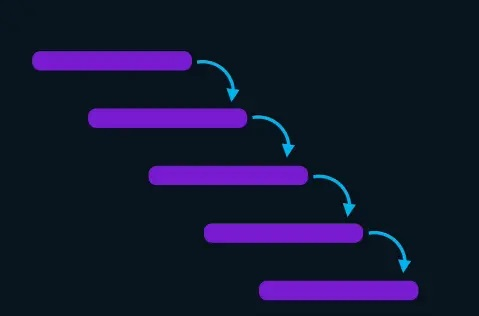

# React redux

This library helps to handle with state; it needs:

- A store
- A method access to it, like selectors
- An update method, like triggers, actions or reducers

## Redux basic's

For redux, there must be a unique resource to access the
global state a "store". A store contain a set of different
state we can access, but we can't modify them directly,
redux uses "actions", "actions" are mutation for the state
or the global state. Last but not least, "reduces" are
"pure functions" used to handle with actions.

> Note: Reducers MUST NOT be asynchronous functions

> Note: Pure functions works as same in same out

React uses something quite similar to Vuex, let's check


## Prop Drilling

This is a side effect of using something like context, it's...
Hardcore, essentially it's like a callback hell, it happens when
we pass props to one component to other just to render information
on a children



That's spaghetti code.

## Context vs Redux

React Context solves this, it shares data from components, it's useful
for handling with states that are expected not to changes a lot:

- Themes (Light/dark)

- User data

- Language

Redux is easier to debug, but increase bundle size, it's easier to use
middlewares, it also comes with a different life cycle... Redux can also
prevent useless renders.

#### In short

Context works for small projects, without a bunch of data, while redux
works for bigger ones with lots of state

## Redux mappers

```javascript
const mapState = (state) => ({ someState: state.someState });
const mapDispatch = { setSomeState: (value) => setSomeStateAction(value) };
```

As it says, those are mappers, mappers helps components to handle with
redux connection

> Some [reference](https://redux.js.org/usage/usage-with-typescript#usage-with-react-redux)

## Mappers/Connect "HOC" vs useSelector/useDispatch "hooks"

The recommended way are "hooks", using "HOC" testing is easier, but it's
kind of awful, since we need to add props to our components also create some
functions/objects call "map-" `mapState` and `mapDispatch` then, we use a
wrapper (Which is the HOC) call `connect` to make a connector instance with
those "map-"

```javascriptreact
// Redux mappers
const mapState = (state) => ({ someState: state.someState });
const mapDispatch = { setSomeState: (value) => setSomeStateAction(value) };
const connector = connect(mapState, mapDispatch);

const App = ({ someState, setSomeState }) => {
  //...
}

export default connector(App)
```

That approach makes a lot of boilerplate.

In the other hand, we have "hooks" approach which is a lot easier to use

```javascriptreact

const App = () => {
  const someState = useSelector((state) => state.someState);
  const dispatch = useDispatch();

  //...
  dispatch(setSomeState(someValue)); // Here we change the state
  //...
}

export default App
```

This reduce a lot boilerplate

## Redux dev Tools

To use dev tools here, it's necessary to add a line of code inside
`createStore`, we get this

```javascriptreact
const store = createStore(
  reducer,
  window.__REDUX_DEVTOOLS_EXTENSION__ && window.__REDUX_DEVTOOLS_EXTENSION__(),
);
```

## [Redux thunk](https://github.com/reduxjs/redux-thunk) (React like)

It helps you to delay some responses, this feature allow you to handle
with multiple response such as fetch, async/await, etc.

Redux thunks defines itself as: "Thunk middleware for Redux. It allows
writing functions with logic inside that can interact with a Redux
store's `dispatch` and `getState` methods."

## [Redux Saga](https://redux-saga.js.org/) (Angular like)

Redux Saga is another middleware we can use instead of Redux Thunk, it
aims to solve similar problems to those that Thunk solves, it is focus
on management of "side-effects" such as API calls using "sagas", scalability
composition, testing process, etc

## [Zustand form pmndrs](https://github.com/pmndrs/zustand) (Vue like)

This is a small, fast and scalable bearbones state-management solution
using simplified flux principles. Has a comfy API based on hooks,
isn't boilerplatey or opinionated.

# Immutability

Redux requires to maintain some short of status quo it needs it to work
Redex'll update the UI only with something change, so it's necessary to
work under that principle, there's a packer call "immutability-js" which
can help with this there's also another package call "redux-immutable"
both of them solve this issue under redux needs

# Combine Reducers

This feature is so useful when you're looking for some way to split the
main or root reducer into different files or variables easier to handle
with, `combineReducers` is its name for redux, it'll help devs to split
a giant reducer into smaller ones


# Redux toolkit

Redux toolkit is an interesting option to reduce the amount of boilerplate
it owns several functionalities and features, including asynchronous queries
"auto code", etc
