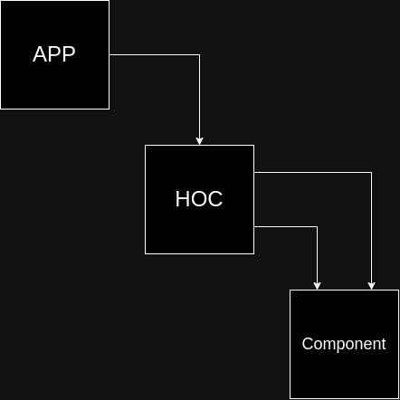

# High Order Components

This is just a pretty name for something from native JS, a "HOC"
is basically the old way to make a class, removing "class" keyword
returning a function with any parameter. It's technical name is
call currying

> Note: Currying in JavaScript is a process that allows you to transform a function with multiple arguments into a sequence of nesting functions

If we see it in common JavaScript

```javascript
const wrappingFunction(url) {
    const apiData = fetchApi(url)

    return function dataManager(handler) {
        handler(apiData)
    }
}

...

wrappingFunction("random.com")(someFunction)
```

As components for React for those fancy "HOC"

```jsx
const wrappingComponent(url) {
    const { fetchApi } = useFetchApi()
    const apiData = fetchApi(url)

    return const component = (handler) => {
        const result = handler(apiData)
        return (
            <p>{result}</p>
        )
    }
}

...

wrappingComponent("random.com")(someFunction)
```

Of course we can concatenate "HOC" or use compounded components too

```jsx
const someComponent(props) {
    return <p>{props.something}</p>
}

// HOC
const wrappingComponent() {
    // Do something

    const component = (handler) => {
        const result = handler(apiData)
        return (
            <p>{result}</p>
        )
    }

    return component
}
```


